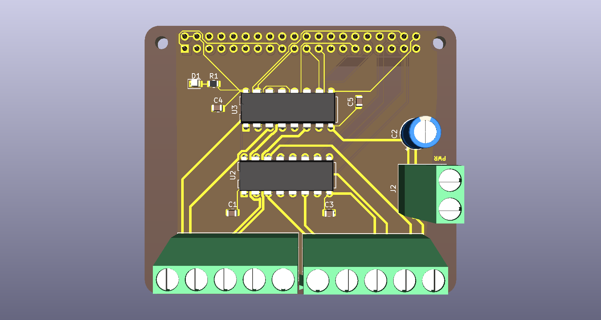

# QuadMotorHAT

A simple Raspberry Pi HAT for controlling four DC motors.



## Why I made it

While making my WRO robot, I ran into a problem: I needed to control multiple motors from a Raspberry Pi without a mess of separate boards and wiring.

There are already plenty of motor HATs available, but I wanted something simple that fit what I needed. So I decided to design my own.

## Features

* **4 motor control** — Control four motors from the Raspberry Pi using the included Python library.
* **Screw terminals** — Secure connections for the motors and power.
* **Compact design** — Keeps a low profile while leaving enough room for a cooling fan on the Raspberry Pi.
* **Simple Python control** — Control the motors directly from your Python project.

## Python Library

The repository includes `quadmotorhat.py`, which provides a simple interface for controlling the four motors.

First, install `gpiozero`:

```bash
pip install gpiozero
```

Then place `quadmotorhat.py` in the same directory as your Python program:

```text
your_project/
├── quadmotorhat.py
└── main.py
```

Import the motor controls:

```python
from quadmotorhat import M1, M2, M3, M4
```

You can then use `M1`, `M2`, `M3`, and `M4` to control the four motor outputs.

## PCB Files

The full board design is included in the repository.

* `QuadMotorHAT.kicad_sch` — Schematic
* `QuadMotorHAT.kicad_pcb` — PCB layout
* `QuadMotorHAT.kicad_pro` — KiCad project

You can open these files in KiCad to inspect or modify the design.


## License

This project is licensed under the terms of the license included in this repository.
